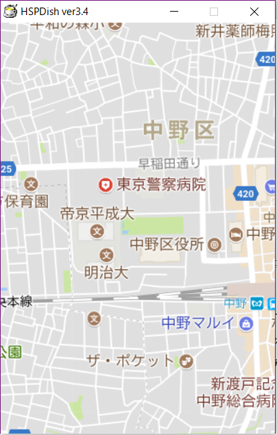

# PinchInOut
Googleマップのピンチインとピンチアウトの再実装
## 概要
Google社が提供している地図情報提供サービスの[Google マップ](https://www.google.co.jp/maps)を題材にした。サービス内では数多くのインタラクティブなアクションを用いるが、スマートフォンやタブレット、一部windowsディバイス上で利用可能なマルチタッチにおけるピンチイン、ピンチアウトの動作におけるズームイン、ズームアウトの再実装を行った。
## 言語
[Hot Soup Processor - Ver.3.4](http://hsp.tv/)
## 起動
hspをインストールし、pintchInOut.hspを開いてF5で起動できる。

なお、hspはファイルをShift-JISで保存しているため文字化けを場合がある。
